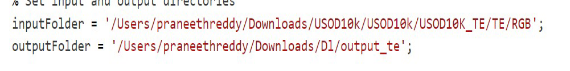
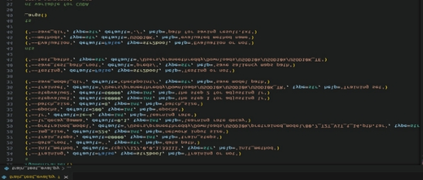

Step 1: First, go to the preprocessing folder located in the codes folder. Navigate to the  main.m  file.

Step 2: Modify the directories for your input RGB images that require preprocessing, such as color fusion and enhancement.

Step 3: Save the enhanced images in the output directory specified in  main.m . Step 4: Store the outputs as required for the USOD code, as illustrated below.

Step 5: Below are the RGB directories for test and train datasets, respectively.

Step 6: Navigate to the directory containing  train\_test\_eval.py . Open it and update the paths to your stored pretrained model, trainset, testset, and other required files.

Step 7: Once all directories and requirements for training, testing, and evaluation are set up, run the following command: 

python3 train\_test\_eval.py --Training 1 --Testing 1 --Evaluation 1 > log/loss.log &

Step 8: Afterward, you will observe epochs running, as shown below.

Step 9: To check the last 300 lines of the log, use the following command: tail -f -n 300 log/loss.log

Step 10: After 200 epochs, the testing procedure begins, as seen below. Step 11: At the 60,000th iteration, a checkpoint will be saved as  UVST.pth .

Step 12: Evaluation metrics will be available in  result.txt . Below are attached results for the model.

Step 13: In the zip file  30\_dl\_code , I have included preprocessing and  USOD\_10k  code. Preprocessing comprises color enhancement Matlab code, while  USOD\_10k  contains datasets, pretrained models, and Python files for evaluation, testing, and training.

